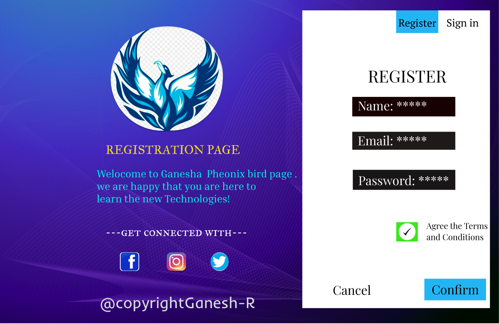
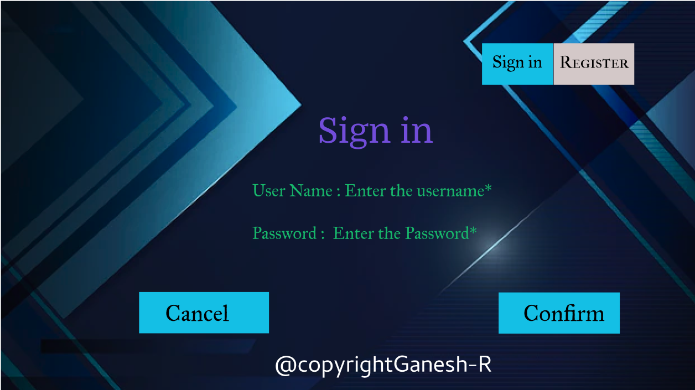
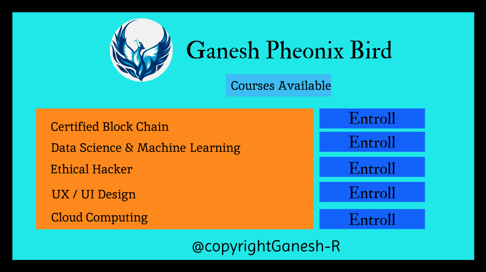

# Event Registration Web Application

## AIM:
To design, develop and deploy a web application for event registration.

## DESIGN STEPS:

### Step 1:
create a new frame.
### Step 2:
select any one present size of your choice
### Step 3:
select the shape you needed
### Step 4:
Import images as needed and create pages based on your need and link there.
### Step 5:
Validate the HTML and CSS code.
### Step 6:
Validate the HTML and CSS code.
### Step 7:
Publish the website in the given URL.

## DESIGN:
FIGMA
## PROGRAM :
Regstration Page
```css
/* Slide 16:9 - 1 */


position: relative;
width: 1920px;
height: 1174px;

background: #FFFFFF;

/* OIP 1 */


position: absolute;
width: 430.12px;
height: 396.39px;
left: 424px;
top: 100.3px;

background: url(OIP.jpg);
filter: drop-shadow(0px 4px 4px rgba(0, 0, 0, 0.25));
border-radius: 198.195px;
transform: rotate(-1.11deg);

/* REGISTRATION PAGE */


position: absolute;
width: 552px;
height: 97px;
left: 408px;
top: 536px;

font-family: 'IM FELL Great Primer SC';
font-style: normal;
font-weight: 400;
font-size: 48px;
line-height: 59px;

color: #E8D61D;

/* Welocome to Ganesha Pheonix bird page . we are happy that you are here to learn the new Technologies! */


position: absolute;
width: 898px;
height: 154px;
left: 374px;
top: 633px;

font-family: 'Inria Serif';
font-style: normal;
font-weight: 400;
font-size: 40px;
line-height: 48px;

color: #00FFF0;

/* ---get connected with--- */


position: absolute;
width: 545px;
height: 59px;
left: 408px;
top: 851px;

font-family: 'IM FELL Great Primer SC';
font-style: normal;
font-weight: 400;
font-size: 48px;
line-height: 59px;
/* identical to box height */


color: #FFFFFF;

/* @copyrightGanesh-R */


position: absolute;
width: 596px;
height: 75px;
left: 386px;
top: 1114px;

font-family: 'Inder';
font-style: normal;
font-weight: 400;
font-size: 60px;
line-height: 75px;
/* identical to box height */


color: #D9D9D9;

/* Rectangle 1 */


position: absolute;
width: 721px;
height: 1143px;
left: 1164px;
top: 31px;

background: #FFFFFF;

/* REGISTER */


position: absolute;
width: 336px;
height: 86px;
left: 1416px;
top: 239px;

font-family: 'Playfair Display';
font-style: normal;
font-weight: 400;
font-size: 64px;
line-height: 85px;
/* identical to box height */


color: #000000;

/* Name: ***** */


position: absolute;
width: 267px;
height: 64px;
left: 1377px;
top: 363px;

font-family: 'Playfair Display';
font-style: normal;
font-weight: 400;
font-size: 48px;
line-height: 64px;
/* identical to box height */


color: #FFF5F5;

/* Email: ***** */


position: absolute;
width: 267px;
height: 64px;
left: 1377px;
top: 497px;

font-family: 'Playfair Display';
font-style: normal;
font-weight: 400;
font-size: 48px;
line-height: 64px;
/* identical to box height */


color: #FFFFFF;

/* Password: ***** */


position: absolute;
width: 349px;
height: 64px;
left: 1379px;
top: 650px;

font-family: 'Playfair Display';
font-style: normal;
font-weight: 400;
font-size: 48px;
line-height: 64px;
/* identical to box height */


color: #FFFFFF;

/* OIP (3) 1 */


position: absolute;
width: 64px;
height: 65px;
left: 1535px;
top: 848px;

background: url(OIP (3).jpg);
border-radius: 100px;

/* Agree the Terms and Conditions */


position: absolute;
width: 244px;
height: 86px;
left: 1641px;
top: 835px;

font-family: 'Playfair Display';
font-style: normal;
font-weight: 400;
font-size: 32px;
line-height: 43px;

color: #000000;

/* Cancel */


position: absolute;
width: 147px;
height: 64px;
left: 1281px;
top: 1071px;

font-family: 'Playfair Display';
font-style: normal;
font-weight: 400;
font-size: 48px;
line-height: 64px;
/* identical to box height */


color: #000000;

/* Confirm */


position: absolute;
width: 182px;
height: 64px;
left: 1661px;
top: 1069px;

font-family: 'Playfair Display';
font-style: normal;
font-weight: 400;
font-size: 48px;
line-height: 64px;
/* identical to box height */


color: #000000;
```
Site Page
```css
/* Rectangle 1 */


position: absolute;
width: 196px;
height: 115px;
left: 1330px;
top: 117px;

background: #14BFE5;

/* geqs4twh 1 */


position: absolute;
width: 1928px;
height: 1080px;
left: 0px;
top: 0px;

background: url(geqs4twh.png);

/* Sign in */


position: absolute;
width: 139px;
height: 59px;
left: 1358px;
top: 138px;

font-family: 'IM FELL Great Primer';
font-style: normal;
font-weight: 400;
font-size: 48px;
line-height: 59px;
/* identical to box height */


color: #000000;

/* Rectangle 2 */


position: absolute;
width: 223px;
height: 115px;
left: 1528px;
top: 117px;

background: #D3C8C8;

/* Register */


position: absolute;
width: 192px;
height: 56px;
left: 1544px;
top: 141px;

font-family: 'IM FELL French Canon SC';
font-style: normal;
font-weight: 400;
font-size: 48px;
line-height: 56px;

color: #000000;

/* Sign in */


position: absolute;
width: 409px;
height: 139px;
left: 875px;
top: 306px;

font-family: 'Domine';
font-style: normal;
font-weight: 400;
font-size: 96px;
line-height: 109px;

color: #724DDA;

/* User Name : Enter the username* Password : Enter the Password* */


position: absolute;
width: 710px;
height: 218px;
left: 694px;
top: 494px;

font-family: 'IM FELL Great Primer';
font-style: normal;
font-weight: 400;
font-size: 48px;
line-height: 59px;

color: #17B66A;

/* Rectangle 3 */


position: absolute;
width: 359px;
height: 114px;
left: 382px;
top: 805px;

background: #14BFE5;

/* Cancel */


position: absolute;
width: 177px;
height: 78px;
left: 454px;
top: 824px;

font-family: 'IM FELL Great Primer';
font-style: normal;
font-weight: 400;
font-size: 64px;
line-height: 78px;

color: #000000;

position: absolute;
width: 335px;
height: 114px;
left: 1376px;
top: 806px;

background: #14BFE5;

/* Confirm */


position: absolute;
width: 226px;
height: 78px;
left: 1444px;
top: 824px;

font-family: 'IM FELL Great Primer';
font-style: normal;
font-weight: 400;
font-size: 64px;
line-height: 78px;

color: #000000;

/* @copyrightGanesh-R */


position: absolute;
width: 603px;
height: 104px;
left: 756px;
top: 961px;

font-family: 'Cambay';
font-style: normal;
font-weight: 400;
font-size: 64px;
line-height: 104px;

color: #FFFFFF;
```
Course Page
```css
/* Ganesh Pheonix  Bird */


position: absolute;
width: 1285px;
height: 205px;
left: 387px;
top: 61px;

font-family: 'Inter';
font-style: normal;
font-weight: 800;
font-size: 96px;
line-height: 116px;

color: #0E0C75;


/* OIP 1 */


position: absolute;
width: 174.53px;
height: 170.29px;
left: 209px;
top: 46.82px;

background: url(OIP.jpg);
border-radius: 117px;
transform: rotate(-1.26deg);


/* Rectangle 1 */


position: absolute;
width: 365px;
height: 76px;
left: 568px;
top: 213px;

background: #70DDDD;


/* Courses Available */


position: absolute;
width: 315px;
height: 48px;
left: 593px;
top: 227px;

font-family: 'Inter';
font-style: normal;
font-weight: 400;
font-size: 40px;
line-height: 48px;

color: #000000;


/* Rectangle 2 */


position: absolute;
width: 1440px;
height: 33px;
left: 0px;
top: 0px;

background: #D9D9D9;

/* Rectangle 4 */

position: absolute;
width: 1440px;
height: 35px;
left: 0px;
top: 989px;

background: #D9D9D9;

/* Rectangle 5 */

position: absolute;
width: 33px;
height: 970px;
left: 1407px;
top: 19px;

background: #D9D9D9;

/* Rectangle 6 */

position: absolute;
width: 322px;
height: 67px;
left: 1004px;
top: 425px;

background: #0E0C75;

/* Rectangle 7 */

position: absolute;
width: 322px;
height: 67px;
left: 1004px;
top: 815px;

background: #0E0C75;

/* Rectangle 8 */

position: absolute;
width: 322px;
height: 67px;
left: 1004px;
top: 710px;

background: #0E0C75;

/* Rectangle 9 */

position: absolute;
width: 322px;
height: 67px;
left: 1004px;
top: 615px;

background: #0E0C75;

/* Rectangle 10 */

position: absolute;
width: 322px;
height: 67px;
left: 1004px;
top: 520px;

background: #0E0C75;

/* Entroll */

position: absolute;
width: 105px;
height: 48px;
left: 1112px;
top: 434px;

font-family: 'Inter';
font-style: normal;
font-weight: 400;
font-size: 40px;
line-height: 48px;

color: #FFFFFF;

/* Entroll */

position: absolute;
width: 105px;
height: 48px;
left: 1131px;
top: 825px;

font-family: 'Inter';
font-style: normal;
font-weight: 400;
font-size: 40px;
line-height: 48px;

color: #FFFFFF;

/* Entroll */

position: absolute;
width: 105px;
height: 48px;
left: 1112px;
top: 725px;

font-family: 'Inter';
font-style: normal;
font-weight: 400;
font-size: 40px;
line-height: 48px;

color: #FFFFFF;

/* Entroll */

position: absolute;
width: 105px;
height: 48px;
left: 1113px;
top: 529px;

font-family: 'Inter';
font-style: normal;
font-weight: 400;
font-size: 40px;
line-height: 48px;

color: #FFFFFF;

/* Entroll */

position: absolute;
width: 105px;
height: 48px;
left: 1114px;
top: 625px;

font-family: 'Inter';
font-style: normal;
font-weight: 400;
font-size: 40px;
line-height: 48px;

color: #FFFFFF;

/* @copyrightGanesh-R */

position: absolute;
width: 584px;
height: 67px;
left: 530px;
top: 922px;

font-family: 'Inter';
font-style: normal;
font-weight: 200;
font-size: 36px;
line-height: 44px;

color: #000000;

/* Rectangle 11 */

position: absolute;
width: 878px;
height: 457px;
left: 107px;
top: 425px;

background: #1C929A;

/* Certified Block Chain */

position: absolute;
width: 560px;
height: 47px;
left: 141px;
top: 443px;

font-family: 'Inter';
font-style: normal;
font-weight: 600;
font-size: 40px;
line-height: 48px;

color: #FFF500;

/*  Datascience & Machine Learning */

position: absolute;
width: 863px;
height: 56px;
left: 137px;
top: 525px;

font-family: 'Inter';
font-style: normal;
font-weight: 600;
font-size: 40px;
line-height: 48px;

color: #FFF500;

/* Ethical Hacker */

position: absolute;
width: 610px;
height: 50px;
left: 137px;
top: 610px;

font-family: 'Inter';
font-style: normal;
font-weight: 600;
font-size: 40px;
line-height: 48px;

color: #FFF500;

/* UX / UI Design */

position: absolute;
width: 471px;
height: 43px;
left: 141px;
top: 706px;

font-family: 'Inter';
font-style: normal;
font-weight: 600;
font-size: 40px;
line-height: 48px;

color: #FFF500;

/* Cloud Computing */

position: absolute;
width: 431px;
height: 45px;
left: 141px;
top: 792px;

font-family: 'Inter';
font-style: normal;
font-weight: 600;
font-size: 40px;
line-height: 48px;

color: #FFF500;
```
## OUTPUT:



## Result:
The program to design .develope and display a web application for event registration is completed successfully.